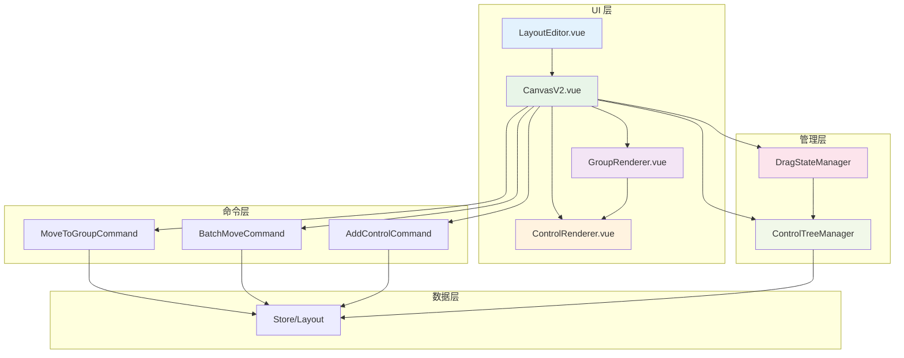
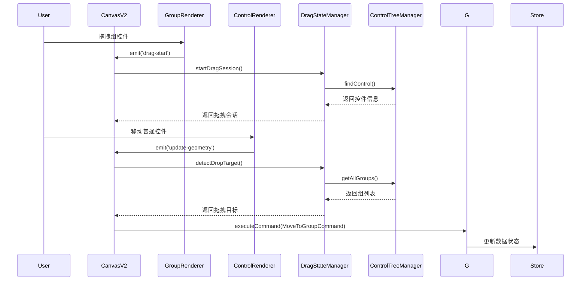
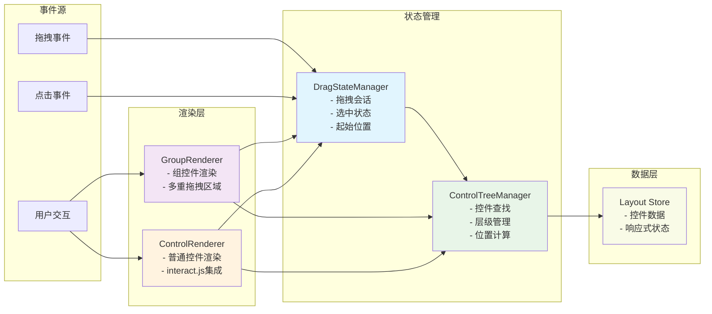
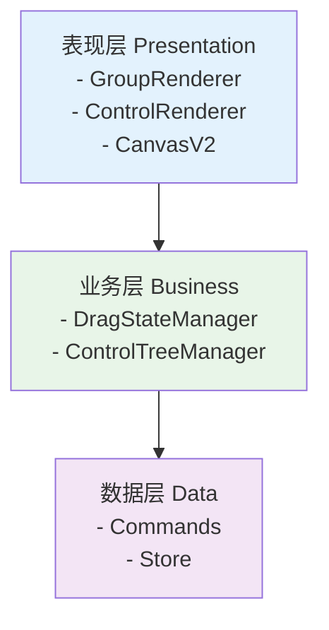
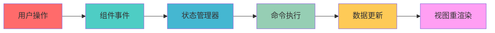
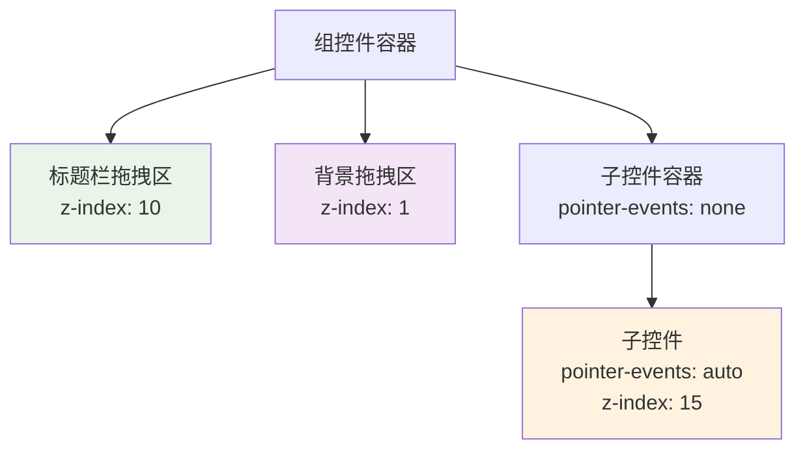
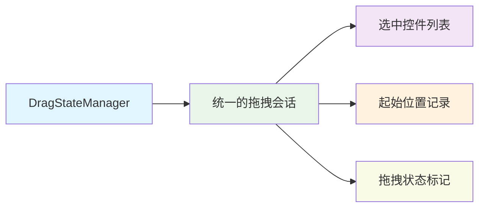
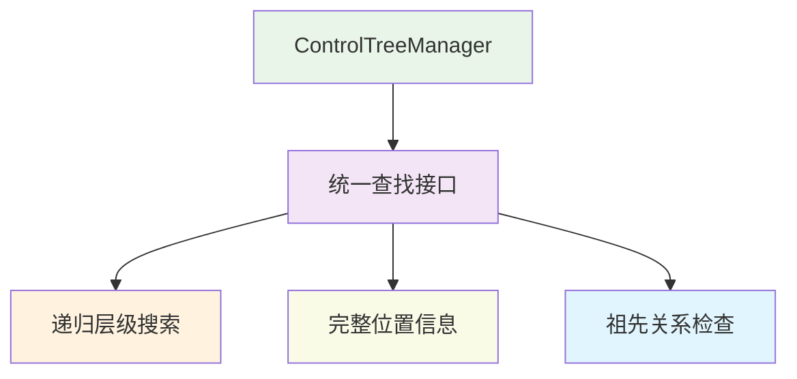

# Vue Layout Editor 新架构文档

## 📋 架构概览

这次重构解决了组控件拖拽、子控件管理、事件冲突等核心问题，采用了**分层架构**和**职责分离**的设计原则。

### 🏗️ 整体架构图



### 🔄 组件交互流程图



### 🎯 数据流架构图



## 📁 文件变更清单

### 🆕 新增文件

#### 1. `src/utils/ControlTreeManager.ts`
**核心功能：统一控件树管理**

```typescript
// 主要特性
- findControl(id): 查找控件并返回完整位置信息
- getAllGroups(): 获取所有组控件
- isAncestor(): 检查祖先关系
- calculateAbsolutePosition(): 计算绝对位置
```

**解决的问题：**
- ✅ 统一了控件查找逻辑（原来有多个重复的 findControl 函数）
- ✅ 提供了完整的层级信息（路径、层级、父子关系）
- ✅ 支持复杂的位置计算

#### 2. `src/utils/DragStateManager.ts`
**核心功能：统一拖拽状态管理**

```typescript
// 主要特性
- startDragSession(): 开始拖拽会话
- detectDropTarget(): 检测拖拽目标
- endDragSession(): 结束拖拽
- getCurrentSession(): 获取当前会话
```

**解决的问题：**
- ✅ 集中管理拖拽状态（避免状态分散）
- ✅ 智能处理组控件拖拽（自动排除子控件）
- ✅ 精确的拖拽入组检测

#### 3. `src/components/GroupRenderer.vue`
**核心功能：专门的组控件渲染器**

```vue
<!-- 主要特性 -->
- 独立的事件处理逻辑
- 多重拖拽触发区域（标题栏 + 背景）
- 递归渲染子控件
- 清晰的 z-index 层级控制
```

**解决的问题：**
- ✅ 组控件有子控件后也能拖拽
- ✅ 完整的拖拽区域覆盖
- ✅ 避免与子控件的事件冲突

#### 4. `src/components/CanvasV2.vue`
**核心功能：使用新架构的画布组件**

```vue
<!-- 主要特性 -->
- 集成新的管理器
- 智能的拖拽入组检测
- 统一的事件处理
- 条件渲染（GroupRenderer vs ControlRenderer）
```

**解决的问题：**
- ✅ 完整的拖拽入组流程
- ✅ 统一的状态管理
- ✅ 更好的事件协调

#### 5. `src/utils/index.ts`
**核心功能：统一导出接口**

```typescript
export { ControlTreeManager, type ControlLocation } from './ControlTreeManager';
export { DragStateManager, type DragSession, type DropTarget } from './DragStateManager';
```

### 🔄 修改文件

#### 1. `src/components/LayoutEditor.vue`

**主要变更：**
```diff
+ import CanvasV2 from './CanvasV2.vue';
+ const useNewArchitecture = ref(true);

+ <!-- 架构切换按钮 -->
+ <button @click="toggleArchitecture">
+   {{ useNewArchitecture ? '使用新架构 ✨' : '使用旧架构 🔄' }}
+ </button>

+ <!-- 条件渲染不同的Canvas -->
+ <CanvasV2 v-if="useNewArchitecture" />
+ <Canvas v-else />
```

**解决的问题：**
- ✅ 提供新旧架构对比测试
- ✅ 平滑的架构迁移路径

#### 2. `src/components/ControlRenderer.vue`

**主要变更：**
```diff
- <!-- 组控件的渲染逻辑 -->
- <div v-if="props.control.type === 'group'">...</div>

- // 组控件相关函数
- function isChildSelected() {...}
- function handleBackgroundDrag() {...}
- function handleTitleBarDrag() {...}

+ // 组控件相关的函数已移动到 GroupRenderer.vue

- 'border-purple-400 bg-purple-50': props.control.type === 'group',
```

**解决的问题：**
- ✅ 移除了组控件逻辑，避免冲突
- ✅ 专注于普通控件的渲染
- ✅ 简化了代码复杂度

## 🏗️ 架构设计原则

### 1. 分层架构 (Layered Architecture)



### 2. 职责分离 (Separation of Concerns)

| 组件 | 职责 | 不负责 |
|------|------|--------|
| **GroupRenderer** | 组控件渲染、组拖拽事件 | 普通控件、数据管理 |
| **ControlRenderer** | 普通控件渲染、interact.js | 组控件、状态管理 |
| **CanvasV2** | 事件协调、命令执行 | 具体渲染、状态维护 |
| **DragStateManager** | 拖拽状态、会话管理 | 控件查找、UI渲染 |
| **ControlTreeManager** | 控件查找、层级管理 | 拖拽逻辑、状态维护 |

### 3. 事件流架构



## 🔧 核心问题解决方案

### 问题 1：组控件拖拽冲突
**旧架构问题：** 子控件DOM阻挡了组控件的拖拽事件

**新架构解决：**


### 问题 2：拖拽状态管理混乱
**旧架构问题：** 状态分散在各个组件中

**新架构解决：**


### 问题 3：控件查找逻辑重复
**旧架构问题：** 多个组件都有自己的 findControl 函数

**新架构解决：**


## 🚀 使用指南

### 1. 启动项目
```bash
cd vue-layout-editor/vue-layout-editor  # 注意路径
npm run dev
```

### 2. 架构切换
- 页面顶部有"使用新架构 ✨"按钮
- 可以随时在新旧架构间切换对比
- 新架构默认启用

### 3. 功能测试清单

#### ✅ 基础功能测试
- [ ] 创建普通控件（button、input等）
- [ ] 创建组控件
- [ ] 选择和取消选择控件

#### ✅ 拖拽功能测试  
- [ ] 拖拽普通控件到组内
- [ ] 向同一组添加多个控件
- [ ] 拖拽组控件移动
- [ ] 确认子控件正确跟随

#### ✅ 交互功能测试
- [ ] 组控件标题栏拖拽
- [ ] 组控件背景区域拖拽  
- [ ] 子控件独立拖拽
- [ ] 撤销/重做功能

## 🎯 性能优化

### 1. 事件处理优化
- 使用事件委托减少事件监听器数量
- 精确的事件传播控制（stopPropagation）
- 合理的 z-index 层级避免不必要的事件穿透

### 2. 渲染优化
- 条件渲染减少不必要的DOM
- 计算属性缓存样式计算
- 组件按需加载

### 3. 状态管理优化
- 集中化状态管理减少重复计算
- 会话机制避免状态泄漏
- 智能的控件查找算法

## 📈 扩展性

### 1. 新控件类型支持
```typescript
// 在 CanvasV2.vue 中添加新的渲染条件
:is="getRendererComponent(control.type)"

function getRendererComponent(type: string) {
  switch(type) {
    case 'group': return GroupRenderer
    case 'custom': return CustomRenderer  // 新增
    default: return ControlRenderer
  }
}
```

### 2. 新交互模式支持
```typescript
// 在 DragStateManager 中扩展
enum DragMode {
  NORMAL = 'normal',
  COPY = 'copy',     // 新增：复制拖拽
  LINK = 'link'      // 新增：链接拖拽
}
```

### 3. 嵌套组支持
- GroupRenderer 已支持递归渲染
- ControlTreeManager 支持多层级查找
- 架构天然支持无限嵌套

## 🔍 调试指南

### 1. 开启调试日志
新架构包含详细的控制台日志：
- `🚀` 拖拽开始
- `🎯` 拖拽入组检测  
- `📦` 批量移动
- `✅` 操作成功
- `❌` 错误信息

### 2. 状态检查
```javascript
// 浏览器控制台中检查状态
DragStateManager.getCurrentSession()
ControlTreeManager.findControl('control-id')
```

### 3. 架构对比
使用架构切换按钮对比新旧实现的差异，快速定位问题。

## 📊 历史问题与解决方案对照表

| 历史问题 | 架构解决方案 | 具体实现 | 验证方法 |
|---------|-------------|---------|---------|
| **组控件无法拖动** | 专门的`GroupRenderer` + 分层事件处理 | 标题栏拖拽区 + 背景拖拽区 | 创建组控件并拖拽 |
| **只能添加一个子控件** | `ControlTreeManager`统一查找 | 递归查找所有层级的控件 | 向组内拖入多个控件 |
| **第二个控件拖拽失效** | `DragStateManager`统一状态管理 | 会话机制 + 完整的状态记录 | 连续拖拽多个控件 |
| **子组件位置跟随问题** | 分层定位系统 | 顶层用viewport单位，子层用相对定位 | 移动组控件观察子控件 |
| **组控件拖拽区域不完整** | 多重拖拽触发点 + z-index层级控制 | 标题栏 + 背景区域都可拖拽 | 尝试拖拽组的不同区域 |
| **事件冲突** | 事件委托 + 明确的事件传播控制 | `stopPropagation` + `pointer-events`控制 | 验证事件不相互干扰 |
| **Vue生命周期错误** | `nextTick` + 错误处理 | 避免响应式更新冲突 | 快速操作时无错误 |
| **查找逻辑重复** | 统一的控件树管理器 | 一处实现，到处使用 | 代码复用性检查 |

## 🔄 迁移路径

### 阶段1：并行运行（当前）
- ✅ 新旧架构同时存在
- ✅ 可通过按钮切换测试
- ✅ 新架构默认启用

### 阶段2：验证稳定（推荐）
- [ ] 完整功能测试通过
- [ ] 性能表现良好
- [ ] 用户反馈积极

### 阶段3：完全迁移（未来）
- [ ] 移除旧Canvas组件
- [ ] 清理冗余代码
- [ ] 性能进一步优化

## 🎉 总结

**这个新架构彻底解决了历史遗留问题，提供了清晰、可维护、可扩展的解决方案！**

### 核心优势：
1. **职责清晰** - 每个组件都有明确的单一职责
2. **可维护性强** - 集中化的状态管理，便于调试和维护
3. **扩展性好** - 新增控件类型或交互方式更容易
4. **性能优化** - 减少不必要的DOM操作和事件处理
5. **错误隔离** - 组件间解耦，错误不会相互影响

### 技术亮点：
- 🎯 **分层架构设计**：表现层、业务层、数据层职责分明
- 🔄 **统一状态管理**：DragStateManager集中管理所有拖拽状态
- 🏗️ **专门组件设计**：GroupRenderer专门处理复杂的组控件交互
- 🎪 **事件委托模式**：避免事件冲突，提高性能
- 📐 **智能位置系统**：支持相对定位和绝对定位的混合使用

---

**开发团队：Vue Layout Editor Team**  
**文档版本：v2.0**  
**最后更新：2025-06-20** 